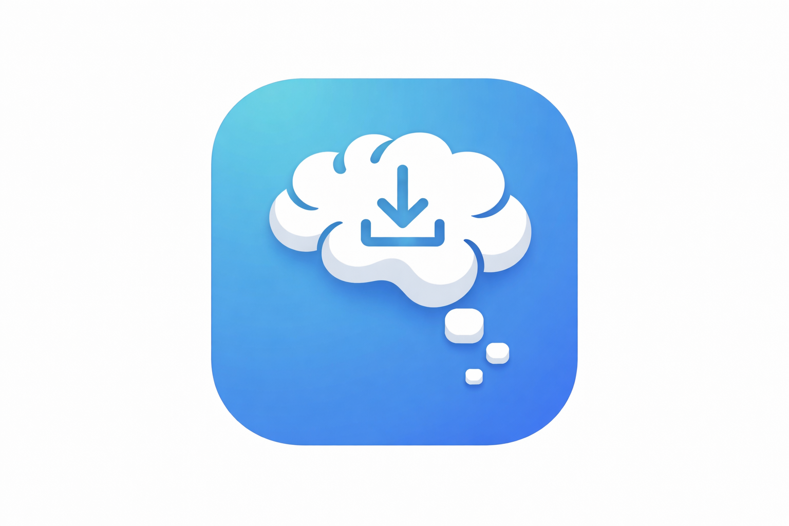

# MindToss

> Schnell Gedanken aus dem Kopf, per Mail weiterleiten, App schließt sich. Fertig.

<p align="center">
  
</p>

MindToss ist eine minimalistische Android-App, die Gedanken, Notizen und Links blitzschnell per E-Mail weiterleitet – über die [Resend](https://resend.com) API.

## Features

- **Schnelle Eingabe** – Großes Textfeld, tippen oder Spracheingabe
- **Zwei Kanäle** – Mail-Button (Notizen) & Task-Button (Aufgaben/Kanban)
- **Auto-Close** – Nach erfolgreichem Senden schließt sich die App automatisch
- **Offline-Queue** – Kein Internet? Nachricht wird automatisch gesendet, sobald Verbindung besteht
- **Share Target** – Inhalte direkt aus anderen Apps teilen
- **Titel-Fetch** – Automatischer Seitentitel-Abruf bei geteilten Links
- **Spracheingabe** – Voice-to-Text über Android Speech API
- **Draft Auto-Save** – Entwurf wird automatisch gespeichert
- **Historie** – Alle gesendeten Nachrichten einsehen, erneut senden, kopieren oder löschen
- **Themes** – System / Hell / Dunkel

## Setup

### Voraussetzungen

- Android Studio (aktuelle Version)
- Android SDK 35
- JDK 17

### Resend konfigurieren

1. Erstelle einen Account bei [resend.com](https://resend.com)
2. Erstelle einen API-Key unter **API Keys**
3. Verifiziere deine Domain oder nutze die Resend-Testdomain
4. Starte MindToss und trage in den **Einstellungen** ein:
   - Resend API-Key
   - Absender-E-Mail (z.B. `notes@meinedomain.de`)
   - Empfänger-E-Mail für Notizen (Pflicht)
   - Empfänger-E-Mail für Tasks (optional)

### Bauen

```bash
# Debug
./gradlew assembleDebug

# Release (erfordert Signing-Konfiguration)
./gradlew assembleRelease
```

### Release-Signing

Für signierte Release-Builds:

```bash
./gradlew assembleRelease \
  -Pandroid.injected.signing.store.file=/pfad/zur/keystore.jks \
  -Pandroid.injected.signing.store.password=STORE_PASSWORT \
  -Pandroid.injected.signing.key.alias=KEY_ALIAS \
  -Pandroid.injected.signing.key.password=KEY_PASSWORT
```

## GitHub Actions Release

Ein Release wird automatisch erstellt, wenn ein Git-Tag gepusht wird:

```bash
git tag v1.0.0
git push origin v1.0.0
```

### Benötigte GitHub Secrets

| Secret              | Beschreibung                                         |
| ------------------- | ---------------------------------------------------- |
| `KEYSTORE_BASE64`   | Base64-kodierter Keystore (`base64 -i keystore.jks`) |
| `KEYSTORE_PASSWORD` | Keystore-Passwort                                    |
| `KEY_ALIAS`         | Key-Alias                                            |
| `KEY_PASSWORD`      | Key-Passwort                                         |

## Architektur

| Schicht          | Technologie                        |
| ---------------- | ---------------------------------- |
| UI               | Jetpack Compose, Material Design 3 |
| State Management | MVVM mit Jetpack ViewModels        |
| Lokaler Speicher | DataStore Preferences              |
| HTTP             | Ktor Client                        |
| Mail-Service     | Resend REST API                    |
| Offline-Queue    | WorkManager                        |
| Serialisierung   | kotlinx.serialization              |

## Mail-Format

| Feld    | Wert                   |
| ------- | ---------------------- |
| Format  | Plain Text             |
| Betreff | Erste Zeile des Textes |
| Body    | Alle weiteren Zeilen   |

## Lizenz

Open Source – siehe Repository.
